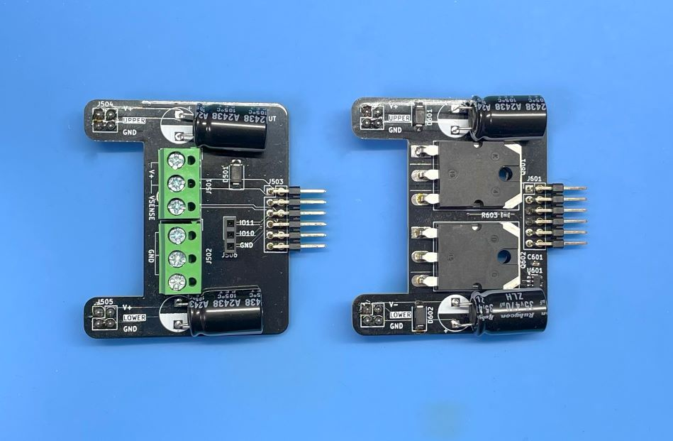
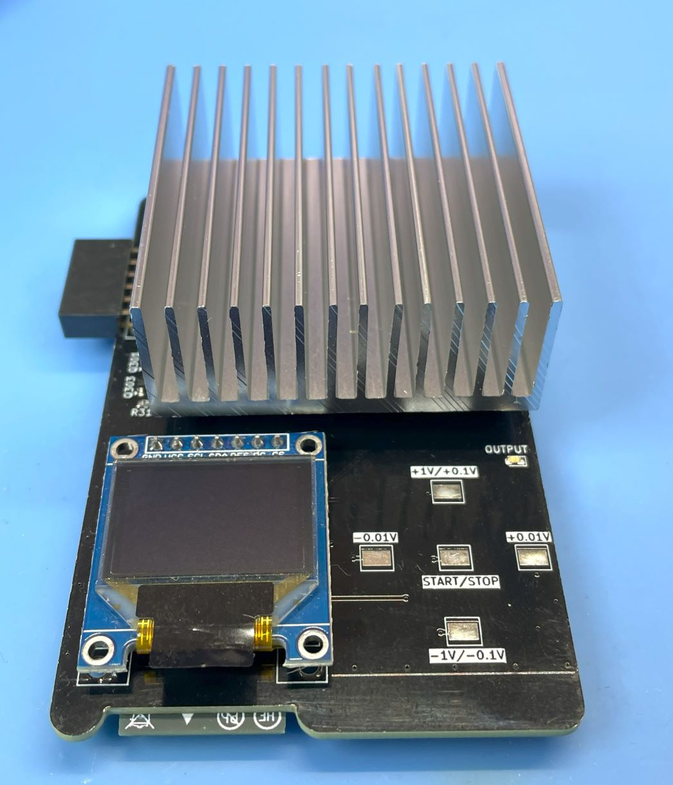
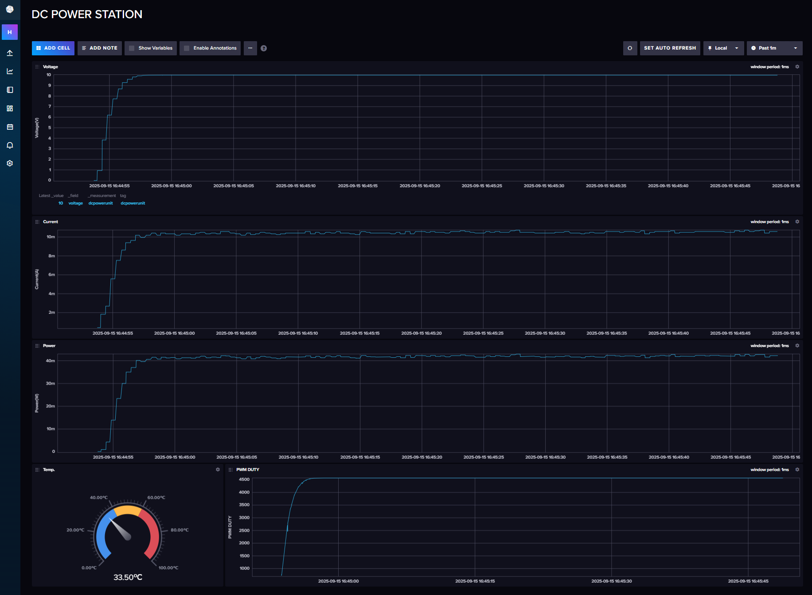

<div align="center">
  <h1><code>DC Power Unit for Breadboard</code></h1>
  <p>
    
  </p>
</div>

# DC Power Unit for Breadboard

This is a DC Power Unit for Breadboard based on ESP32-S3 microcontroller and AP33772S USB Power Delivery (PD) Sink Controller. It can supply power to the breadboard from USB Power Delivery (PD) Charger with support for both Standard Power Range (SPR) and Extended Power Range (EPR) modes. The output voltage can be controlled from 0v to 20V in SPR mode and up to 30V(*1) in EPR mode with step of 10mV.   
There are 2 types of adopters for the output terminal: Single positive power output terminal and dual positive/negative output terminal. It is easy to connect to the breadboard with standard 2.54mm pitch pin header. If you select the dual positive/negative output terminal adopter, the output voltage can be halved by positive and negative voltage. E.g. If you set the output voltage to 20V, you can get +10V and -10V from the positive and negative output terminal.

***1: Some PD chargers may not support EPR mode or only support up to 16V/5A. Please check your PD charger specifications.**



The left image shows the single positive output terminal adopter, and the right image shows the dual positive/negative output terminal adopter.

## Key Features

- **High Power Delivery**: Up to 100W from USB PD Charger
- **Multiple Voltage Outputs**: 0V to 20V in SPR mode, 0V to 30V in EPR mode (10mV steps)
- **High Current Support**: Up to 5A when PD Charger supports EPR, but some chargers support up to 90% of the maximum current.
- **Touch Control Interface**: Front panel touch switch for voltage selection and output control
- **Precise Control**: PID controller maintains constant output voltage
- **High Accuracy Monitoring and Control**: 10mV voltage accuracy using shunt resistor and INA228 current sensor, with 1mV resolution.
- **Real-time Display**: OLED display shows voltage, current, power consumption, and temperature
- **Data Logging**: WiFi connectivity for sending measurement data to InfluxDB server
- **Web Dashboard**: Data visualization using InfluxDB dashboard
- **Safety Features**: Over Voltage Protection (OVP), Under Voltage Protection (UVP), Over Current Protection (OCP). Over Temperature Protection (OTP) does not implemented.

****Note**: If you use 21V or higher voltage, input voltage is 28v or higher, and differential voltage is over 3V and output current is over 3A, the MOSFET device is in the high consumption state and the unit temperature may rise over 80 degrees Celsius. Please be careful about the temperature. You can set the maximum temperature in the configuration file. The default value is 80 degrees Celsius. If the temperature exceeds the limit, the output will be disabled automatically. I recommend using less than 0.7A current at 21V or higher voltage. Otherwise, if you set the output voltage to 27V or higher, the temperature rise is not a problem.**

****Note**: This unit uses a micro controller and a USB PD controller. These controllers need the power to operate. Therefore, if you use a over current, the power source may be shut down by the over current protection of the PD charger. In this case, This unit cannot operate and will be turned off. Please use the current within the specification of your PD charger.**

## Hardware Components

- **ESP32-S3-WROOM-1-N16R8**: Main microcontroller
- **AP33772S**: USB Power Delivery Sink Controller with EPR support
- **INA228**: High-precision current/voltage sensor
- **SSD1331**: Color OLED display (96x64 pixels)
- **Touch Interface**: Capacitive touch sensors for user interaction
- **MOSFET Load Circuit**: Electronic load for testing and regulation



## Software Architecture

The firmware is written in Rust using the ESP-IDF framework and consists of several modules:

- `main.rs`: Main application logic and system initialization
- `usbpd.rs`: AP33772S USB-PD driver interface using the ap33772s-driver crate
- `displayctl.rs`: OLED display control and user interface
- `currentlogs.rs`: Current and voltage measurement using INA228
- `touchpad.rs`: Touch sensor interface and user input handling
- `pidcont.rs`: PID controller for voltage regulation
- `wifi.rs`: WiFi connectivity and network management
- `transfer.rs`: Data transmission to InfluxDB server
- `syslogger.rs`: System logging functionality

ap33772s-driver crate is used for USB-PD communication with the AP33772S controller. Please see the [ap33772s-driver](https://github.com/hnz1102/ap33772s-driver) for more details.

## How to Use the Unit

### Basic Operation

1. **Connection**: Connect a USB-C PD charger to the input port
2. **Power On**: The unit automatically detects the PD source and displays available power profiles
3. **Voltage Selection**: Use the touch interface to select desired output voltage
4. **Output Control**: Press the center touch position to enable/disable output
5. **Monitoring**: View real-time measurements on the OLED display

### Touch Interface Controls

- **Up/Down Touch**: Increase or decrease output voltage in 100mV steps, long press for 1V steps
- **Left/Right Touch**: Increase or decrease output voltage in 10mV steps
- **Center Touch**: Long press to toggle output ON/OFF
- **Display Information**: Shows current voltage, current, power, unit temperature, and WiFi status

**If the output is disabled due to over current, over power, or over temperature, you can clear the error message by pressing the center touch position once.**

### Safety Features

- Under Voltage Protection (UVP)
- Over Voltage Protection (OVP) 
- Over Current Protection (OCP)
- Automatic fault detection and shutdown

These protections are implemented by the AP33772S.

## Dependencies and Crates

The project uses the custom `ap33772s-driver` crate for USB-PD communication:

```toml
[dependencies]
ap33772s-driver = { version = "0.1.1", features = ["std"] }
```

Other key dependencies include:
- `esp-idf-hal` v0.45.2: ESP32 hardware abstraction
- `embedded-hal` v1.0.0: Platform-agnostic hardware interfaces
- `ssd1331` v0.3.0: OLED display driver
- `embedded-graphics` v0.7: Graphics primitives for display
- `chrono` v0.4.38: Date and time handling
- `toml-cfg` v0.1.3: Configuration file parsing


# How to build from code and Install to the unit.

Using Ubuntu 22.04.3 LTS and ESP-IDF V5.4.2

## Prerequisites
Ensure that your system meets the following requirements before proceeding with the installation:
- Operating System: Linux-based distribution
- Required Packages: git, python3, python3-pip, gcc, build-essential, curl, pkg-config, libudev-dev, libtinfo5, clang, libclang-dev, llvm-dev, udev, libssl-dev, python3.10-venv

## Installation Steps

### 1. System Update and Package Installation
Update your system and install the necessary packages using:
```bash
sudo apt update && sudo apt -y install git python3 python3-pip gcc build-essential curl pkg-config libudev-dev libtinfo5 clang libclang-dev llvm-dev udev libssl-dev python3.10-venv
```

### 2. Rust Installation
Install Rust programming language and Cargo package manager:
```bash
curl --proto '=https' --tlsv1.2 -sSf https://sh.rustup.rs | sh
```
After installation, activate Rust by sourcing the environment:
```bash
. "$HOME/.cargo/env"
```

### 3. Additional Tools Installation
Install the following Rust tools:
- ldproxy
- espup
- cargo-espflash

Use the following commands:
```bash
cargo install ldproxy
cargo install espup
cargo install cargo-espflash
```

At this time (2025-07-25), espup cannot be compiled. If you get an error, please use the following command to install the toolchain.
```bash
cargo install cargo-binstall
cargo binstall espup
```

### 4. ESP Environment Setup
Run the following command to install and update the Espressif Rust ecosystem:
```bash
espup install
espup update
```
Set up environment variables:
```bash
. ./export-esp.sh
```

### 5. Udev Rules Configuration
Configure udev rules for device permissions:
```bash
sudo sh -c 'echo "SUBSYSTEMS==\"usb\", ATTRS{idVendor}==\"303a\", ATTRS{idProduct}==\"1001\", MODE=\"0666\"" > /etc/udev/rules.d/99-esp32.rules'
sudo udevadm control --reload-rules
sudo udevadm trigger
```

### 6. Clone Repository
Clone the DC Power Unit repository:
```bash
git clone https://github.com/hnz1102/dcpower.git
cd dcpower/code
```

### 7. Setting WiFi SSID, Password, etc.
Change the following configuration file: `cfg.toml`
You have to set the following parameters: WiFi SSID, Password, InfluxDB Server IP Address, InfluxDB API Key, and InfluxDB API with your ORG.
You can get the API Key from the InfluxDB Web Console. Please see the 'How to Install the InfluxDB and Configure the Dashboard' section No.3.

```toml
[dcpowerunit]
wifi_ssid = "<Your AP SSID>"  # Set your AP SSID
wifi_psk = "<Your AP Password>" # Set your AP Password
influxdb_server = "<InfluxDB Server IP Address:Port>" # Set your InfluxDB Server IP Address and Port ex. 192.168.1.100:8086
pid_kp = "0.0000005"
pid_ki = "0.00002"
pid_kd = "0.1"
pwm_offset = "0"
pd_config_offset = "1.5"
shunt_resistance = "0.005"
shunt_temp_coefficient = "50"
max_current_limit = "5.2"
max_power_limit = "100.0"
max_temperature_limit = "75" # Set the maximum temperature limit in degrees Celsius. Default is 75 degrees.
influxdb_api_key = "<InfluxDB API KEY>" # Set your InfluxDB API Key
influxdb_api = "/api/v2/write?org=<ORG>&bucket=LOGGER&precision=ns" # Set your InfluxDB API with your ORG and BUCKET
influxdb_tag = "dcpowerunit"  # Tag for InfluxDB measurements
influxdb_measurement = "dcpowerunit" # Measurement name for InfluxDB
syslog_server = "<Syslog Server IP Address:Port>" # Set your Syslog Server IP Address and Port ex. 192.168.2.140:514
syslog_enable = "false" # Set to "true" to enable syslog
```

### 8. Build and Flash
Build the project:
```bash
cargo build --release
```

### 9. Flash the Firmware
Connect the DC Power Unit to your PC using a USB cable. Then, flash the firmware:
```bash
cargo espflash flash --release --monitor
```

If your device is not detected, power on the device and during the boot, press the `BOOT` button.
Then, run the flash command again.

### 10. Monitor the Output
After flashing the firmware, the console shows the booting messages and system initialization including:
- WiFi connection status
- AP33772S USB-PD controller initialization
- Available PDO (Power Data Object) detection
- Touch interface activation
- OLED display initialization
```bash
Chip type:         esp32s3 (revision v0.2)
Crystal frequency: 40 MHz
Flash size:        16MB
Features:          WiFi, BLE, Embedded Flash
MAC address:       80:65:99:b8:8e:90
App/part. size:    1,383,760/1,536,000 bytes, 90.09%
[00:00:00] [========================================]      14/14      0x0      Verifying... OK!                   
[00:00:00] [========================================]       1/1       0x8000   Skipped! (checksum matches)        
[00:00:15] [========================================]     864/864     0x10000  Verifying... OK!                   
[2025-09-15T07:23:38Z INFO ] Flashing has completed!
Commands:
    CTRL+R    Reset chip
    CTRL+C    Exit

ESP-ROM:esp32s3-20210327
Build:Mar 27 2021
rst:0x15 (USB_UART_CHIP_RESET),boot:0x8 (SPI_FAST_FLASH_BOOT)
Saved PC:0x40378d03
0x40378d03 - setup_priv_desc$isra$0
    at ??:??
SPIWP:0xee
mode:DIO, clock div:2
load:0x3fce2810,len:0x1564
load:0x403c8700,len:0x4
load:0x403c8704,len:0xd24
load:0x403cb700,len:0x2ed4
entry 0x403c8928
I (27) boot: ESP-IDF v5.4.2 2nd stage bootloader
I (27) boot: compile time Sep 15 2025 07:22:33
I (27) boot: Multicore bootloader
I (28) boot: chip revision: v0.2
I (30) boot: efuse block revision: v1.3
I (34) boot.esp32s3: Boot SPI Speed : 40MHz
I (38) boot.esp32s3: SPI Mode       : DIO
I (41) boot.esp32s3: SPI Flash Size : 16MB
I (45) boot: Enabling RNG early entropy source...
I (50) boot: Partition Table:
I (52) boot: ## Label            Usage          Type ST Offset   Length
I (59) boot:  0 nvs              WiFi data        01 02 00009000 00006000
I (65) boot:  1 phy_init         RF data          01 01 0000f000 00001000
I (72) boot:  2 factory          factory app      00 00 00010000 00177000
I (78) boot: End of partition table
I (81) esp_image: segment 0: paddr=00010020 vaddr=3c0f0020 size=4b244h (307780) map
I (164) esp_image: segment 1: paddr=0005b26c vaddr=3fc9c700 size=04dach ( 19884) load
I (170) esp_image: segment 2: paddr=00060020 vaddr=42000020 size=e89e8h (952808) map
I (404) esp_image: segment 3: paddr=00148a10 vaddr=3fca14ac size=00bfch (  3068) load
I (406) esp_image: segment 4: paddr=00149614 vaddr=40374000 size=186f0h (100080) load
I (437) esp_image: segment 5: paddr=00161d0c vaddr=600fe000 size=0001ch (    28) load
I (447) boot: Loaded app from partition at offset 0x10000
I (447) boot: Disabling RNG early entropy source...
I (457) octal_psram: vendor id    : 0x0d (AP)
I (457) octal_psram: dev id       : 0x02 (generation 3)
I (458) octal_psram: density      : 0x03 (64 Mbit)
I (460) octal_psram: good-die     : 0x01 (Pass)
I (464) octal_psram: Latency      : 0x01 (Fixed)
I (468) octal_psram: VCC          : 0x01 (3V)
I (472) octal_psram: SRF          : 0x01 (Fast Refresh)
I (477) octal_psram: BurstType    : 0x01 (Hybrid Wrap)
I (482) octal_psram: BurstLen     : 0x01 (32 Byte)
I (487) octal_psram: Readlatency  : 0x02 (10 cycles@Fixed)
I (492) octal_psram: DriveStrength: 0x00 (1/1)
I (497) MSPI Timing: PSRAM timing tuning index: 5
I (500) esp_psram: Found 8MB PSRAM device
I (504) esp_psram: Speed: 80MHz
I (507) cpu_start: Multicore app
I (522) cpu_start: Pro cpu start user code
I (522) cpu_start: cpu freq: 160000000 Hz
I (522) app_init: Application information:
I (522) app_init: Project name:     libespidf
I (526) app_init: App version:      100adf2
I (530) app_init: Compile time:     Sep 15 2025 07:22:02
I (535) app_init: ELF file SHA256:  000000000...
I (539) app_init: ESP-IDF:          v5.4.2
I (543) efuse_init: Min chip rev:     v0.0
I (547) efuse_init: Max chip rev:     v0.99 
I (551) efuse_init: Chip rev:         v0.2
I (555) heap_init: Initializing. RAM available for dynamic allocation:
I (561) heap_init: At 3FCA6A48 len 00042CC8 (267 KiB): RAM
I (566) heap_init: At 3FCE9710 len 00005724 (21 KiB): RAM
I (571) heap_init: At 3FCF0000 len 00008000 (32 KiB): DRAM
I (576) heap_init: At 600FE01C len 00001FCC (7 KiB): RTCRAM
I (582) esp_psram: Adding pool of 8192K of PSRAM memory to heap allocator
I (589) spi_flash: detected chip: gd
I (592) spi_flash: flash io: dio
W (595) pcnt(legacy): legacy driver is deprecated, please migrate to `driver/pulse_cnt.h`
W (602) i2c: This driver is an old driver, please migrate your application code to adapt `driver/i2c_master.h`
W (612) timer_group: legacy driver is deprecated, please migrate to `driver/gptimer.h`
I (620) sleep_gpio: Configure to isolate all GPIO pins in sleep state
I (626) sleep_gpio: Enable automatic switching of GPIO sleep configuration
I (633) main_task: Started on CPU0
I (643) esp_psram: Reserving pool of 32K of internal memory for DMA/internal allocations
I (643) main_task: Calling app_main()
I (653) gpio: GPIO[15]| InputEn: 0| OutputEn: 0| OpenDrain: 0| Pullup: 0| Pulldown: 0| Intr:0 
I (653) gpio: GPIO[16]| InputEn: 0| OutputEn: 0| OpenDrain: 0| Pullup: 0| Pulldown: 0| Intr:0 
I (663) gpio: GPIO[46]| InputEn: 0| OutputEn: 0| OpenDrain: 0| Pullup: 0| Pulldown: 0| Intr:0 
I (683) pp: pp rom version: e7ae62f
I (683) net80211: net80211 rom version: e7ae62f
I (693) wifi:wifi driver task: 3fcc44a0, prio:23, stack:6656, core=0
I (693) wifi:wifi firmware version: bea31f3
I (693) wifi:wifi certification version: v7.0
I (693) wifi:config NVS flash: disabled
I (693) wifi:config nano formatting: disabled
I (703) wifi:Init data frame dynamic rx buffer num: 32
I (703) wifi:Init static rx mgmt buffer num: 5
I (713) wifi:Init management short buffer num: 32
I (713) wifi:Init dynamic tx buffer num: 32
I (723) wifi:Init static tx FG buffer num: 2
I (723) wifi:Init static rx buffer size: 1600
I (723) wifi:Init static rx buffer num: 10
I (733) wifi:Init dynamic rx buffer num: 32
I (733) wifi_init: rx ba win: 6
I (733) wifi_init: accept mbox: 6
I (743) wifi_init: tcpip mbox: 32
I (743) wifi_init: udp mbox: 6
I (743) wifi_init: tcp mbox: 6
I (753) wifi_init: tcp tx win: 5760
I (753) wifi_init: tcp rx win: 5760
I (753) wifi_init: tcp mss: 1440
I (763) wifi_init: WiFi IRAM OP enabled
I (763) wifi_init: WiFi RX IRAM OP enabled
I (773) phy_init: phy_version 701,f4f1da3a,Mar  3 2025,15:50:10
I (803) wifi:mode : sta (80:65:99:b8:8e:90)
I (803) wifi:enable tsf
I (3313) wifi:new:<8,0>, old:<1,0>, ap:<255,255>, sta:<8,0>, prof:1, snd_ch_cfg:0x0
I (3313) wifi:state: init -> auth (0xb0)
I (3313) wifi:state: auth -> assoc (0x0)
I (3323) wifi:state: assoc -> run (0x10)
I (3333) wifi:connected with Buffalo-G-1AD0, aid = 4, channel 8, BW20, bssid = c4:3c:ea:df:1a:d0
I (3333) wifi:security: WPA2-PSK, phy: bgn, rssi: -51
I (3333) wifi:pm start, type: 1

I (3333) wifi:dp: 1, bi: 102400, li: 3, scale listen interval from 307200 us to 307200 us
I (3343) wifi:set rx beacon pti, rx_bcn_pti: 0, bcn_timeout: 25000, mt_pti: 0, mt_time: 10000
I (3423) wifi:AP's beacon interval = 102400 us, DTIM period = 1
I (5353) esp_netif_handlers: sta ip: 192.168.2.142, mask: 255.255.255.0, gw: 192.168.2.1
I (9063) wifi:<ba-add>idx:0 (ifx:0, c4:3c:ea:df:1a:d0), tid:0, ssn:3, winSize:64
I (13373) wifi:<ba-add>idx:1 (ifx:0, c4:3c:ea:df:1a:d0), tid:2, ssn:0, winSize:64
I (13383) gpio: GPIO[18]| InputEn: 0| OutputEn: 0| OpenDrain: 0| Pullup: 0| Pulldown: 0| Intr:0 
I (13393) gpio: GPIO[9]| InputEn: 0| OutputEn: 0| OpenDrain: 0| Pullup: 0| Pulldown: 0| Intr:0 
```

## How to Install the influxDB and Configure the Dashboard

### 1. Download [influxDB](https://docs.influxdata.com/influxdb/v2.7/install/?t=Linux) and Install.
```bash
$ wget https://dl.influxdata.com/influxdb/releases/influxdb2-2.7.0-amd64.deb
$ sudo dpkg -i influxdb2-2.7.0-amd64.deb
$ sudo service influxdb start
```

### 2. Configure the influxDB

```
Connect to the 'http://<influxDB installed PC Address>:8086'
```
Click `GET STARTED` and set `Username`, `Password`, `Initial Organization Name`, and `Initial Bucket Name`
|Term|Value|
|---|---|
|Username|Set login username as influxDB administrator web console|
|Password|Set login password as influxDB administrator web console|
|Initial Organization Name| Organization Name ex. ORG|
|Initial Bucket Name| LOGGER |

After set them, click `CONTINUE`.

### 3. Copy the operator API token.

You can see the operator API token on the browser. YOU WON'T BE ABLE TO SEE IT AGAIN!
If you want to get new API token, click `API Tokens` menu form `Sources` Icon, then click `GENERATE API TOKEN` and select `All access token`, click `Save`.
You can see a new API token and get it.
After copy the token, click `CONFIGURE LATER`.

### 4. Import the Dashboard Template.

Click the `Dashboard` icon, and select `Import Dashboard` from the `CREATE DASHBOARD` menu.

Drop the `influxdb/dc_power_station.json` file to `Drop a file here`, then click `IMPORT JSON AS DASHBOARD`.

You can see the `DC POWER STATION` pannel on the Dashboards page.

Click this panel, and You can see the dashboard.



If you want to customize the dashboard design, click configure mark. You can change the graph design.

## Schematic, PCB Gabar Data

There is a Schematic data in hardware directory. 

This PCB is designed by [Kicad](https://www.kicad.org/). 

## LICENSE
This source code is licensed under MIT. Other Hardware Schematic documents are licensed under CC-BY-SA V4.0.
